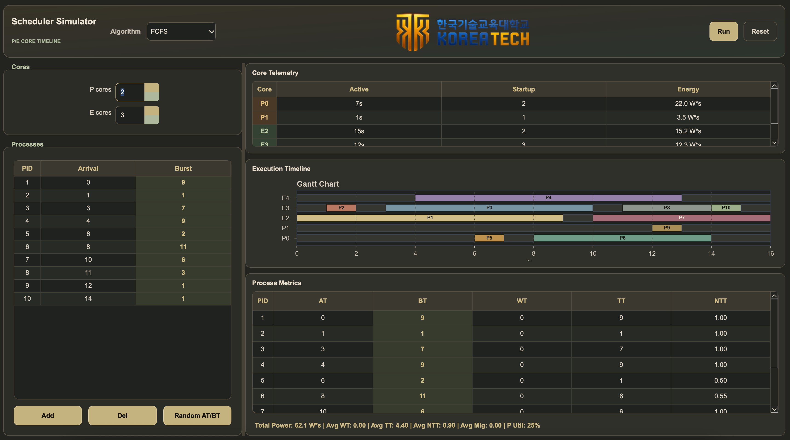

<div align="center">

# Scheduler Simulator

P/E heterogeneous multicore 환경을 가정한 PyQt6 기반 프로세스 스케줄링 시뮬레이터


</div>

## Overview

Scheduler Simulator는 P 코어와 E 코어가 함께 존재하는 이기종 멀티코어 환경에서 프로세스 스케줄링 알고리즘을 비교할 수 있는 GUI 시뮬레이터입니다.

FCFS, RR, SPN, SRTN, HRRN, Custom(EAPB)을 같은 입력 조건에서 실행하고, 실행 타임라인, 프로세스 메트릭, 코어 텔레메트리, 전력 소비를 한 화면에서 확인할 수 있습니다.

<p align="center">
  
</p>

## Highlights

- 6가지 스케줄링 알고리즘 지원: FCFS, RR, SPN, SRTN, HRRN, Custom(EAPB)
- P/E 코어별 처리 속도와 active/startup power 모델 반영
- Gantt 차트 기반 실행 타임라인 시각화
- 프로세스별 `AT`, `BT`, `WT`, `TT`, `NTT` 메트릭 제공
- 코어별 active time, startup count, energy telemetry 제공
- Windows 설치 마법사와 macOS `.pkg` / `.dmg` 배포 빌드 지원

## Quick Start

```bash
conda create -n os_assign python=3.10 -y
conda activate os_assign
pip install -r requirements.txt
python main.py
```

`conda` 대신 Python 내장 가상환경을 사용해도 됩니다.

```bash
python -m venv .venv
source .venv/bin/activate
pip install -r requirements.txt
python main.py
```

개발 중에는 `python main.py`를 기본 실행 명령으로 사용합니다.

## Build Installers

최종 사용자 PC에는 Python과 Python 패키지를 설치할 필요가 없도록 PyInstaller로 앱을 묶습니다.

빌드 PC에는 Python 3.10.8 이상이 필요하며, Python 3.12를 권장합니다. Windows 설치 파일은 Windows에서, macOS 설치 파일은 macOS에서 빌드해야 합니다.

### macOS

```bash
chmod +x build_macos.sh
./build_macos.sh
```

생성 결과:

| 경로 | 용도 |
|---|---|
| `release/SchedulerSimulator.pkg` | macOS 설치 마법사 |
| `release/SchedulerSimulator-mac.dmg` | 배포용 DMG |
| `dist/SchedulerSimulator.app` | 빌드 직후 직접 실행 테스트용 앱 |

`build`, `.pyinstaller-build`, `.venv-build` 안의 파일은 중간 산출물이므로 배포에 사용하지 않습니다.

### Windows

```bat
build_windows.bat
```

생성 결과:

| 경로 | 조건 | 용도 |
|---|---|---|
| `release\SchedulerSimulatorSetup.exe` | Inno Setup 설치됨 | Windows 설치 마법사 |
| `dist\SchedulerSimulator\SchedulerSimulator.exe` | Inno Setup 없음 | portable 실행 파일 |

제출 또는 배포에는 `release\SchedulerSimulatorSetup.exe`를 권장합니다. 빠른 테스트만 필요하면 `dist\SchedulerSimulator\SchedulerSimulator.exe`를 실행하면 됩니다.

## How To Use

1. 좌측 패널에서 P 코어, E 코어 개수를 설정합니다. 기존 4P/8E 고정 제한 없이 더 많은 코어도 입력할 수 있습니다.
2. 프로세스 목록에서 PID, arrival time, burst time을 입력합니다. 15개까지는 한 화면에 보이고, 그 이상은 테이블 스크롤로 계속 입력할 수 있습니다.
3. 필요하면 `Random AT/BT` 버튼으로 합리적인 범위의 입력값을 자동 생성합니다.
4. 상단 toolbar에서 알고리즘을 선택합니다.
5. RR을 선택한 경우 `Time-quantum = δ` 값을 설정합니다.
6. `Run` 버튼을 눌러 시뮬레이션을 실행합니다.

실행 결과는 우측 패널에 표시됩니다.

| 패널 | 내용 |
|---|---|
| Core Telemetry | 코어별 active time, startup count, energy |
| Execution Timeline | 코어별 Gantt chart. 코어 수가 많으면 세로 스크롤로 확인 |
| Process Metrics | 프로세스별 `AT`, `BT`, `WT`, `TT`, `NTT` |

## Algorithms

| Algorithm | Type | Decision Rule |
|---|---|---|
| FCFS | Non-preemptive | arrival time이 빠른 프로세스 우선 |
| RR | Preemptive | tick 단위 time quantum `δ` 순환 배정 |
| SPN | Non-preemptive | burst time이 짧은 프로세스 우선 |
| SRTN | Preemptive | remaining time이 가장 짧은 프로세스 우선 |
| HRRN | Non-preemptive | `(waiting + burst) / burst`가 큰 프로세스 우선 |
| Custom(EAPB) | Hybrid heuristic | urgency, EDP, migration cost를 함께 고려 |

## Custom Algorithm: EAPB

EAPB는 Energy-Aware P-core Boost의 약자입니다. 짧게 말하면 “정말 P 코어가 필요한 프로세스만 P 코어로 밀어주는” 자체 휴리스틱입니다.

핵심 아이디어:

- HRRN 기반 urgency로 오래 기다린 작업의 우선순위를 높입니다.
- EDP(Energy Delay Product)를 이용해 P 코어와 E 코어 중 더 합리적인 코어를 고릅니다.
- 이전에 실행된 코어를 기억해 migration cost를 부여하고 불필요한 이동을 줄입니다.
- starvation 위험이 커질 때만 제한적으로 preemption을 허용합니다.

EAPB의 코어 선택 비용은 다음처럼 계산합니다.

```text
cost(process, core) = edp_cost(process, core)
                    + λ * migration_penalty(process, core)
```

`migration_penalty(process, core)`는 프로세스가 이전에 실행되던 코어와 다른 코어로 옮겨질 때 부과되는 cache affinity 비용입니다. 같은 코어에서 계속 실행되거나 처음 배정되는 프로세스라면 penalty는 `0`입니다. 다른 코어로 이동해야 한다면 cache warmup 1 tick에 해당하는 비용을 현재 후보 코어의 active power와 예상 turnaround time에 비례해 더합니다.

```text
if process.last_core_id is None or process.last_core_id == core.core_id:
    migration_penalty = 0
else:
    migration_penalty = CACHE_WARMUP_TICKS
                      * core.power_active
                      * predicted_turnaround
```

현재 구현에서는 `λ = 0.3`, `CACHE_WARMUP_TICKS = 1`을 사용합니다. 코드에서는 이 항이 `migration_cost(process, core, current_time)`로 구현되어 있습니다.

## Metrics

| Metric | Meaning |
|---|---|
| `AT` | Arrival Time |
| `BT` | Burst Time |
| `WT` | Waiting Time |
| `TT` | Turnaround Time |
| `NTT` | Normalized Turnaround Time |
| `Total Power` | active power와 startup power의 총합 |
| `Avg Mig` | 프로세스당 평균 코어 이동 횟수 |
| `P Util` | P 코어 utilization |

## Simulation Assumptions

- 1 tick은 1 second로 계산합니다.
- arrival time이 현재 tick과 같으면 즉시 ready queue에 들어갑니다.
- 완료 시각은 마지막 실행 tick의 다음 시각입니다.
- Ready queue는 모든 코어가 공유합니다.
- P 코어는 tick당 2 work units를 처리합니다.
- E 코어는 tick당 1 work unit을 처리합니다.
- 남은 일이 1 work unit이어도 해당 tick의 active power는 소비됩니다.
- idle에서 active로 전환되는 tick에만 startup power를 부과합니다.

기본 코어 모델:

| Core | Speed | Active Power | Startup Power |
|---|---:|---:|---:|
| P core | 2 wu/tick | 3.0 W | 0.5 W |
| E core | 1 wu/tick | 1.0 W | 0.1 W |

## Project Structure

```text
.
├── main.py
├── requirements.txt
├── assets/
│   ├── koreatech_logo.png
│   └── koreatech_logo_keyed.png
├── installer/
│   ├── build_app.py
│   └── windows/
│       └── SchedulerSimulator.iss
├── src/
│   ├── algorithms/
│   ├── core/
│   ├── power/
│   └── ui/
├── tests/
├── build_macos.sh
└── build_windows.bat
```

## Tests

```bash
python -m pytest
```
